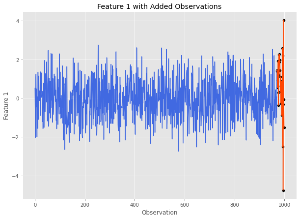
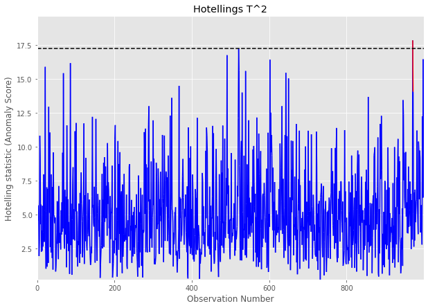
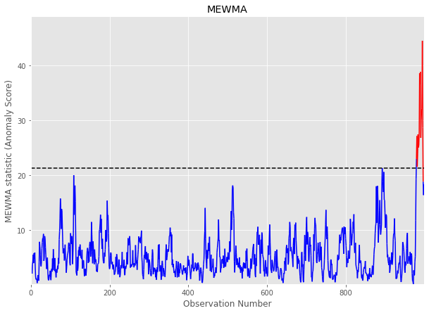
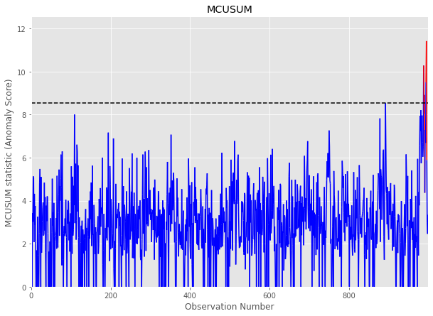

Detecting Anomalies in Multivariate Data
========================================

The purpose of MITTEN is to generate multivariate control charts to detect mean and variability shifts in datasets with large numbers of features. Let’s look at an example to see how these control charts work.

Generate A Dataset
------------------

First we need a dataset to work with. Using `MASE <https://mase.readthedocs.io/>`_, we can generate a multivariate normal Pandas DataFrame with anomalies. Let’s start with a simulated dataset with 1,000 observations and 5 features. The final 30 observations will be anomalies. We will apply a mean shift of 1 standard deviation and 20 observations to feature 1. After feature 1's mean returns to normal, it will undergo a doubling in standard deviation for 10 more observations. For more details on how this can be done using MASE, visit the `documentation <https://mase.readthedocs.io/>`_.

.. code:: python3

    cov = np.eye(5)  # 5 independent features all with 0 mean
    sim = mase.Simulation(1000, covariance_matrix=cov)  # 1000 observations
    specs_df = pd.DataFrame()
    specs_df['mean'] = [1, 0]
    specs_df['sd'] = [1, 2]
    specs_df['n_obs'] = [20, 10] # the last 30 are out of control
    feature_index = 1
    sim.add_gaussian_observations(specs_df, feature_index, visualize=True)

Here is what feature 1 looks like after undergoing these changes:

Before we continue, let's save this data and store the number of in control observations:

.. code:: python3

    data = sim.get_data()
    num_in_control = 1000-30

Control Chart Methods
---------------------

Hotellings T2
~~~~~~~~~~~~~

Our first multivariate control chart method is Hotelling's :math:`T^2`. To call this method, we need (at the bare minimum) the following information:

-  A Pandas DataFrame containing our data with features as integer indexed columns and observations as rows. (``data`` for our example)
-  The number of observations in the DataFrame that are considered to be ‘in control’ (i.e. ``num_in_control`` for our example)

Now that we have this information, let's run Hotelling's :math:`T^2` on our data and plot the control chart.

.. code:: python

    t2_stats, ucl = mitten.hotelling_t2(data, num_in_control, plotting=True)

The horizontal dashed lines represents the UCL, and any values above it are marked in red are `out of control signals`.

This call will also return the list of Hotelling's :math:`T^2` statistic values calculated for the dataset, and a calculated UCL (see Overview for more info). 

.. code:: python

    t2_stats[:5], ucl # let's take a look at the calculated statistics and the plotted UCL

.. parsed-literal::

    ([2.1427070394650616,
      3.1237802220324866,
      0.3701671821840997,
      6.04671502956505,
      4.619356154048912],
     21.336412918623974)

MEWMA
~~~~~

Our next control chart is Multivariate Exponentially Weighted Moving Average (MEWMA). Similar to Hotelling's :math:`T^2`, to call this method we need (at the bare minimum) the following information:

-  A Pandas DataFrame containing our data with features as integer indexed columns and observations as rows. (``data`` for our example)
-  The number of observations in the DataFrame that are considered to be ‘in control’ (i.e. ``num_in_control`` for our example)

.. code:: python

    mewma_stats, ucl = mitten.apply_mewma(data, num_in_control, plotting=True)

This call will also return the list of MEWMA statistic values calculated for the dataset, and a calculated UCL (see Overview for more info). 

MCUSUM
~~~~~~

Our third control chart is Multivariate Cumulative Sum (MCUSUM). Similar to Hotelling's :math:`T^2` and MCUSUM, to call this method we need (at the bare minimum) the following information:

-  A Pandas DataFrame containing our data with features as integer indexed columns and observations as rows. (``data`` for our example)
-  The number of observations in the DataFrame that are considered to be ‘in control’ (i.e. ``num_in_control`` for our example)
-  Slack Parameter (k): This parameter determines the model’s sensitivity and should generally be set to 1/2 of the mean shift you expect to detect. In this example, we are expecting a mean shift of 1 standard deviation for data :math:`\sim N(0,1)`, so let’s set k = 0.5.

.. code:: python

    mcusum_stats, ucl = mitten.mcusum(data, num_in_control, 0.5, plotting=True)

PC-MEWMA
~~~~~~~~

This multivariate control chart method applies MEWMA to the principal components of the provided dataset. Similar to the previous methods, we will require the following information

-  A Pandas DataFrame containing our data with features as integer indexed columns and observations as rows. (``data`` for our example)
-  The number of observations in the DataFrame that are considered to be ‘in control’ (i.e. ``num_in_control`` for our example)
-  The number of principal components to include. For our dataset, lets use 3 principal components.

.. code:: python

    pc_mewma_stats, ucl = mitten.pc_mewma(data, num_in_control, 3, plotting=True)

.. image:: _static/output_25_0.png

Diagnostic Tests
----------------

Now that we have run our control chart methods on our data, we need to determine which feature is at fault for the shift.

To accomplish this, we can use the ``interpret_multivariate_signal()`` method. We pass the method:

-  Our multivariate time series data: ``data``
-  The statistics calculated by our method of choice: let’s use
   ``pc_mewma_stats``
-  A UCL: let’s use the one returned from ``pc_mewma()``

.. code:: python

    mitten.interpret_multivariate_signal(data, pc_mewma_stats, ucl, verbose=True);

.. parsed-literal::

    The most likely culprit features \and average t-statistic ranking in decreasing order are:
    1    1.2
    4    3.2
    0    3.4
    2    3.6
    3    3.6
    dtype: float64

Great! Recall that our true culprit feature was feature 1, and the diagnostic algorithm correctly ranked this feature as the #1 most likely culprit!

